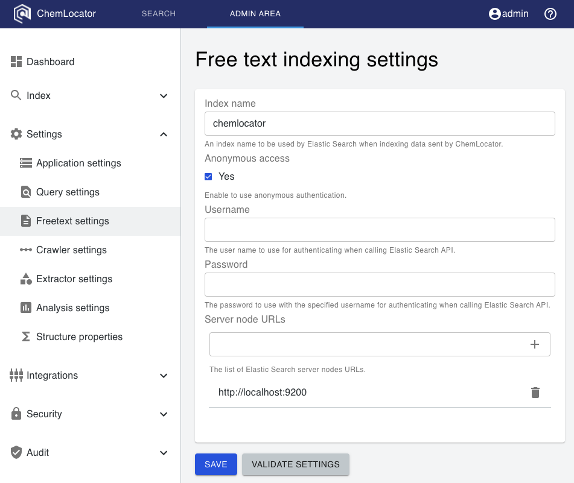

# First time configuration

This guide details the first steps needed to configure ChemLocator following a 
successful installation.  

If you have not yet installed ChemLocator, please 
follow the [installation guide](../installation/installation-overview).

## Elasticsearch settings

Elasticsearch is required in most normal deployment scenarios, and the first 
step after installation should be to inform ChemLocator about the Elasticsearch
server.  You will need to log in with an administrative user.

Open the administrative section of ChemLocator in the top navigation bar:

From the left-side navigation menu, open the Free Text Settings screen:

Next, configure Elasticsearch as follows:

  - Optionally, change the default index name from `chemlocator` to your 
    preferred name.
  - Optionally, if your Elasticsearch server has security enabled, switch off
    anonymous authentication and add a username and password.
  - In the text box under "Server node URLs", type the URL for the Elasticsearch
    endpoint.  The expected format includes `http://` in the beginning.
  - Press enter, or click the plus sign to add the URL to the list.
  - Optionally, if you have multiple Elasticsearch servers, repeat the above two
    steps to add their URLs.
  - Click on "Validate Settings".  If everything worked correctly, a success 
    message should appear, and the configuration of Elasticsearch is completed.

