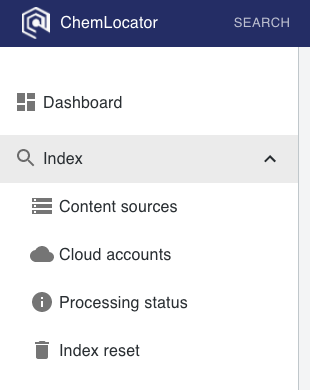

# Indexing 

Indexing is the procedure which takes place before the documents become 
available for searching. All the file contents must be pre-processed by the 
chemistry component with the aim to extract all the chemical information from 
them. Free-text indexing needs the same pre-processing phase as well. 

The goal of this phase is to make the users' queries fast.

The indexing section of the menu contains four screens:

  - [Content sources](content-sources/content-sources-overview.md) - content 
  sources are ChemLocator's terminology for locations where documents are found
  in.  These can be cloud drive locations, local folders, etc.
  - [Cloud credentials](cloud-credentials/cloud-credentials-overview.md) - in the case
  of cloud-based content sources, credentials will need to be provided.  These 
  allow ChemLocator to be able to read the documents in your cloud storage
  location.
  - [Processing status](processing-status.md) - shows the
  status of any ongoing crawling and indexing.
  - [Index reset](index-reset.md) - allows the 
  ChemLocator databases (both PostgreSQL as well as Elasticsearch) to be cleared
  and reset to a pristine state.
