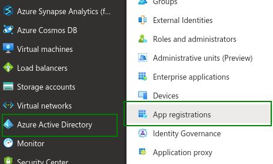

# Prerequisite: Azure AD (Optional)

ChemLocator supports using AzureAD as security provider. For this additional configuration is required. If you are planning to use another authentication 
provider, this guide can be skipped.

## Azure configuration

In order for ChemLocator to be able to use Azure Active Directory you will need an account that is allowed to register applications with Azure.

### Application registration

To register ChemLocator with Azure you will need to login into [Azure Portal](https://portal.azure.com/) and navigate to Azure Active Directory -> App registrations and click _New registration_.

 Here you can give a name to your application registration (e.g. ChemLocator) and choose _Accounts in this organizational directory only (ChemAxon Kft only - Single tenant)_.
 For _Redirect URI_ you can add the public URLs that are needed for ChemLocator to function properly (as an example we will be using https://chemlocator.contoso.com as the base url):
 
- https://chemlocator.contoso.com/login
- https://chemlocator.contoso.com/admin/indexing/cloudaccounts/office365complete
- https://chemlocator.contoso.com/profile/myprofile
- https://chemlocator.contoso.com/profile
- https://chemlocator.contoso.com/admin/profile/myprofile

!!! info "SSL with ChemLocator"
    In order to access ChemLocator HTTPS protocol you will have to create a reverse proxy pointing to the Docker container address on port 3050 (default port); if the reverse proxy is created on the Docker host server you can point it to http://localhost:3050.

    We will provide a basic example on how to configure `nginx` on the Docker host to create a reverse proxy for https://chemlocator.contoso.com.

    The following entries can be added to `/etc/nginx/nginx,conf` or a `nginx` site configuration file to create a reverse proxy for https://chemlocator.contoso.com with a redirect to https to ensure correct functioning of ChemLocator with Azure authentication.

    Redirect http://chemlocator.contoso.com to https://chemlocator.contoso.com:

        server {
            listen 80 default_server;
            server_name chemlocator.contoso.com;
            return 301 https://$host$request_uri;
        }
    
    Reverse proxy setup:

        server {
            listen       443 ssl;
            server_name  chemlocator.contoso.com;
            ssl_certificate      certificate.cert;
            ssl_certificate_key  certificate.key;
            ssl_session_cache    shared:SSL:1m;
            ssl_session_timeout  5m;
            ssl_ciphers  HIGH:!aNULL:!MD5;
            ssl_prefer_server_ciphers  on;
            types_hash_max_size 4096;
            location / {
                proxy_set_header    Host localhost;
                proxy_set_header    X-Real-IP   $remote_addr;
                proxy_set_header    X-Forwarded-For $proxy_add_x_forwarded_for;
                proxy_pass  http://localhost:3050;
            }
        }
    
    **The certificate are not provided by ChemLocator and you will need to provide valid or self-signed certificates**.

### Certificate creation for Azure App Registration

For communicating with SharePoint Online and other Office 365 apps we will need to create a self-signed certificate and upload it to _Cetificates & secrets_ page.

To create a certificate using PowerShell you can follow this MSDN guide: https://docs.microsoft.com/en-us/azure/active-directory/develop/howto-create-service-principal-portal#option-1-upload-a-certificate

To create a certificate using Linux command line follow these steps:

* Create a self signed certificate by running this command in a terminal: _openssl req -x509 -sha256 -nodes -days 1825 -newkey rsa:2048 -keyout cl-azure-privateKey.key -out cl-azure-selfsigncert.crt_
    * Provide the requested information
* Export the certificate by running the following command: _openssl pkcs12 -export -out cl-azure-selfsigncert.pfx -inkey cl-azure-privateKey.key -in cl-azure-selfsigncert.crt_
    * Provide a password for the certificate
    * Copy this file to the folder where azuread.env is located
* Upload the crt file to _Cetificates & secrets_ page

### Permissions configuration

ChemLocator requires a specific set of permissions to be able to access you cloud data. With the permissions set below ChemLocator will be able to index (if content sources are set up) SharePoint Online libraries and OneDrive documents.

!!! attention
    Some permissions are duplicated because they are delegate or application permissions. Make sure the permissions match the image above.

### Configuring docker-compose.yml and azuread.env

In this section we will configure ChemLocator to use Azure as the authentication provider and we will be setting up the connection details for Azure.

Open docker-compose.yml with you favorite editor and change `"CL_CONFIG_AUTHENTICATIONTYPE=ldap"` to `"CL_CONFIG_AUTHENTICATIONTYPE=AzureAd"` and if `env_file` section does not exist add it and add `- azuread.env` on the next line.

Next we will be creating `azuread.env` file (if it exists we will just edit it) and make sure the file has the following contents:

    azuread.env
        
        CL_CONFIG_AZUREAD__AUTHORIZATIONENDPOINT=https://login.microsoftonline.com/{tenant id}/oauth2/v2.0/authorize
        CL_CONFIG_AZUREAD__INSTANCE=https://login.microsoftonline.com/
        CL_CONFIG_AZUREAD__DOMAIN={domain}
        CL_CONFIG_AZUREAD__TENANTID={tenant id}
        CL_CONFIG_AZUREAD__CLIENTID={client id}
        CL_CONFIG_AZUREAD__CLIENTSECRET={secret}
        CL_CONFIG_AZUREAD__RedirectUrl={Redirect URL}
        #Set the initial ChemLocator administrator account (This can be removed once a new administrator is assigned)
        #e.g. cl-administrator@contoso.com
        CL_CONFIG_AZUREAD__ADMINACCOUNT={ChemLocator administrator account}
        #The password provided in Certificate creation for Azure App Registration section
        CL_CONFIG_AZUREAD__CERTIFICATEPASSWORD=
        CL_CONFIG_AZUREAD__ROLESTOGROUPSMAP__CHEMLOCATORUSER__0={first group id}
        #CL_CONFIG_AZUREAD__ROLESTOGROUPSMAP__CHEMLOCATORUSER__1={second group id}
        CL_CONFIG_AZUREAD__ROLESTOGROUPSMAP__CHEMLOCATORADMIN__0={first admin group id}
        #CL_CONFIG_AZUREAD__ROLESTOGROUPSMAP__CHEMLOCATORADMIN__1={second group id}

- Replace `{domain}` with the domain that is registered in Azure (e.g. _contoso.com_)
- Replace `{tenant id}` with the tenant id from the overview page. **NOTE** replace this value for the URL set for `CL_CONFIG_AZUREAD__AUTHORIZATIONENDPOINT` as well
- Replace `{client id}` with the client id (also known as application id) from the overview page

    

- Create a client secret using _Certificates & secrets_ page and then replace `{secret}` with the secret you just created
- Replace `{Redirect URL}` with _https://contoso.com/login_. **Replace _contoso.com_ with your ChemLocator URL**
- Replace `{ChemLocator administrator account}` with the user account that will be the initial ChemLocator administrator, e.g. cl-admin@contoso.com. This account can be removed after a new administrator is added to ChemLocator as it will count towards the user limit of ChemLocator license
- Replace `{first group id}` with the identifier of an Azure group that will contain users that are allowed to log into ChemLocator. If you would like to add more groups add new lines containingn `CL_CONFIG_AZUREAD__ROLESTOGROUPSMAP__CHEMLOCATORUSER__{N}={group id}` where `{N}` is the index number of the group (e.g. for a second group add or uncomment `CL_CONFIG_AZUREAD__ROLESTOGROUPSMAP__CHEMLOCATORUSER__2={second group id}`)
- Replace `{first admin group id}` with the identifier of an Azure group that will contain users that will have administrative permission in ChemLocator. These users will also have to be members of a group specified at the previous point. Also, here you can specify multiple groups that will be granted administrative rights in ChemLocator by following the steps at the previous point, but using `CL_CONFIG_AZUREAD__ROLESTOGROUPSMAP__CHEMLOCATORADMIN__{N}` variable instead

    

Uncomment the following lines in _docker-compose.yml_

    docker-compose.yml

        #- "CL_CONFIG_AZUREAD__UA=NONISV|ChemAxon|${CL_CONFIG_AZUREAD__TENANTID}/${CL_VERSION}"

        #- ${CL_PATH}/cl-azure-selfsigncert.pfx:/app/azure.pfx
